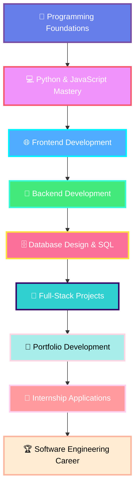

<div align="center">

# 💫 J.S Shakya Abhiman


</div>

---

<div align="center">

### 🌐 Connect With Me

[](https://www.linkedin.com/in/abhiman-shakya)
[](https://github.com/Abhiman)
[](https://www.instagram.com/_______.abhii._/)
[](mailto:abhiman.shakya@student.nsbm.ac.lk)


</div>

---

## 🎯 About Me


```python
class SoftwareEngineer:
    def __init__(self):
        self.name = "J.S Shakya Abhiman"
        self.role = "Aspiring Software Engineer"
        self.university = "NSBM Green University"
        self.location = "Matara, Sri Lanka 🇱🇰"
        self.education = "BSc (Hons) in Computing"
        
    def technical_skills(self):
        return {
            "languages": ["Python", "JavaScript", "HTML5", "CSS3", "SQL"],
            "frameworks": ["Bootstrap", "Node.js", "jQuery"],
            "tools": ["Git", "GitHub", "VS Code", "MySQL", "Figma"],
            "concepts": ["OOP", "DSA", "Web Development", "Database Design"]
        }
    
    def current_focus(self):
        return [
            "📚 Strengthening DSA foundations",
            "🌐 Building full-stack web applications",
            "💾 Mastering database management",
            "🎯 Preparing for technical interviews",
            "🚀 Creating portfolio projects"
        ]
    
    def life_motto(self):
        return "Consistency, clarity, and continuous learning build great engineers"
```

<br clear="right"/>

🎓 **Education:** BSc (Hons) in Computing at NSBM Green University  
💼 **Status:** Undergraduate Student | Actively Seeking Internship Opportunities  
🌱 **Currently Learning:** Advanced Python, Full-Stack Web Development, Data Structures & Algorithms  
💡 **Passionate About:** Problem Solving, Clean Code Architecture, Software Design Patterns  
🎯 **Career Goal:** Becoming a proficient Software Engineer building innovative, scalable solutions  
📍 **Location:** Matara, Western Province, Sri Lanka

---

## 🛠️ Technology Stack

<div align="center">

### Programming Languages


### Frameworks & Libraries


### Tools & Technologies


</div>

---

## 📚 Academic Focus & Learning Areas

<table>
<tr>
<td width="50%" valign="top">

### 💻 Core Computer Science
- ✅ **Fundamentals of Programming** (Python, JavaScript)
- 🔄 **Data Structures & Algorithms** (Arrays, LinkedLists, Trees, Graphs)
- ✅ **Object-Oriented Programming** (Encapsulation, Inheritance, Polymorphism)
- 🔄 **Database Management Systems** (SQL, Normalization, ER Diagrams)
- ✅ **Logic Gates & Boolean Algebra** (Digital Logic Design)
- 🔄 **Software Engineering Principles** (SDLC, Agile, Design Patterns)
- ✅ **Discrete Mathematics** (Set Theory, Graph Theory, Combinatorics)
- 🔄 **Computer Architecture** (CPU, Memory, I/O Systems)

</td>
<td width="50%" valign="top">

### 🌐 Web Development & Technologies
- ✅ **Frontend Development** (HTML5, CSS3, JavaScript ES6+)
- 🔄 **Responsive Web Design** (Mobile-First, Flexbox, Grid)
- ✅ **UI/UX Fundamentals** (User Experience, Wireframing, Prototyping)
- ✅ **Version Control** (Git Workflow, Branching, Merging)
- 🔄 **Backend Development** (Node.js, Express.js, REST APIs)
- 📋 **Full-Stack Integration** (Frontend-Backend Communication)
- 🔄 **Web Security Basics** (Authentication, Authorization, HTTPS)
- 📋 **Deployment & Hosting** (GitHub Pages, Heroku, Vercel)

</td>
</tr>
</table>

**Legend:** ✅ Completed | 🔄 In Progress | 📋 Planned

---

## 📊 GitHub Analytics

<div align="center">
  


<br/>


</div>

---

## 🎯 Learning Roadmap 2025-2026



---

## 🏆 Goals & Progress Tracker

<div align="center">

| 🎯 Goal | 📊 Progress | ⏰ Timeline | ✅ Status |
|---------|-------------|-------------|-----------|
| Master Python Programming |  | Q1 2025 | 🔄 In Progress |
| Complete 10 Web Development Projects |  | Q2 2025 | 🔄 In Progress |
| Master Data Structures & Algorithms |  | Q2 2025 | 🔄 In Progress |
| Build Full-Stack Portfolio Website |  | Q1 2025 | 🔄 In Progress |
| Contribute to 5 Open Source Projects |  | Q3 2025 | 📋 Planned |
| Complete Database Design Course |  | Q1 2025 | 🔄 In Progress |
| Secure Software Engineering Internship |  | Q2-Q3 2025 | 🎯 Target |
| Earn Professional Certification |  | Q4 2025 | 📋 Planned |

</div>

---

## 💼 Professional Skills & Strengths

<div align="center">

<table>
<tr>
<td align="center" width="25%">
<br>
<b>Analytical Thinking</b><br>
<sub>Strong problem-solving & logical reasoning</sub>
</td>
<td align="center" width="25%">
<br>
<b>Clean Code</b><br>
<sub>Writing readable, maintainable code</sub>
</td>
<td align="center" width="25%">
<br>
<b>Team Collaboration</b><br>
<sub>Effective communication & teamwork</sub>
</td>
<td align="center" width="25%">
<br>
<b>Quick Learner</b><br>
<sub>Fast adaptation to new technologies</sub>
</td>
</tr>
<tr>
<td align="center" width="25%">
<br>
<b>Problem Solving</b><br>
<sub>Algorithmic thinking & debugging</sub>
</td>
<td align="center" width="25%">
<br>
<b>Project Management</b><br>
<sub>Organized & deadline-focused</sub>
</td>
<td align="center" width="25%">
<br>
<b>UI/UX Awareness</b><br>
<sub>User-centered design thinking</sub>
</td>
<td align="center" width="25%">
<br>
<b>Attention to Detail</b><br>
<sub>Quality-focused development</sub>
</td>
</tr>
</table>

</div>

---

## 🤝 Open for Opportunities

<table>
<tr>
<td width="50%">

### 💼 Looking For
- 🎓 **Internship Opportunities** in Software Development
- 🚀 **Entry-Level Projects** for hands-on experience
- 👥 **Collaborative Learning** with fellow developers
- 📚 **Mentorship Programs** from industry professionals
- 🌟 **Open Source Contributions** to real-world projects
- 💡 **Hackathons & Coding Competitions**

</td>
<td width="50%">

### 🎯 Can Contribute To
- **Web Development Projects** (Frontend/Backend)
- **Python Automation Scripts**
- **Database Design & Optimization**
- **UI/UX Design & Prototyping**
- **Technical Documentation**
- **Code Review & Testing**
- **Academic Research Projects**

</td>
</tr>
</table>

---

## 📫 Get In Touch

<div align="center">

### Let's Connect and Build Something Amazing Together!

I'm always excited to connect with fellow developers, potential mentors, and industry professionals. Whether you have an opportunity, want to collaborate on a project, or just want to chat about technology - I'd love to hear from you!

**📧 Email:** [abhiman.shakya@student.nsbm.ac.lk](mailto:abhiman.shakya@student.nsbm.ac.lk)  
**💼 LinkedIn:** [Connect with me](https://www.linkedin.com/in/abhiman-shakya)  
**🐙 GitHub:** [Follow my journey](https://github.com/Abhiman)  
**📸 Instagram:** [Behind the scenes](https://www.instagram.com/_______.abhii._/)

<br>

**Best time to reach:** Weekdays 9 AM - 6 PM (Sri Lanka Time - UTC+5:30)  
**Response time:** Usually within 24 hours

</div>

---

## 💭 Random Dev Quote

<div align="center">


</div>

---

## 🏆 GitHub Trophies

<div align="center">


</div>

---

<div align="center">

### 💡 Professional Philosophy

> *"The best way to predict the future is to create it. Every line of code is a step towards building tomorrow's solutions. Stay curious, stay consistent, and never stop learning."*

---

### 📊 Profile Metrics


---

### 🌟 Support My Journey

If you find my projects interesting or helpful, consider:
- ⭐ **Starring** my repositories
- 🔀 **Forking** and contributing to my projects
- 📢 **Sharing** my work with others
- 💬 **Providing feedback** and suggestions

**Every star motivates me to keep building and learning!**

---

### 📈 Recent Activity

<!--START_SECTION:activity-->
<!--END_SECTION:activity-->

</div>

---


<div align="center">
  
</div>

---

<div align="center">
<sub>Last Updated: January 2025 | Handcrafted with passion by Abhiman</sub>
</div>
